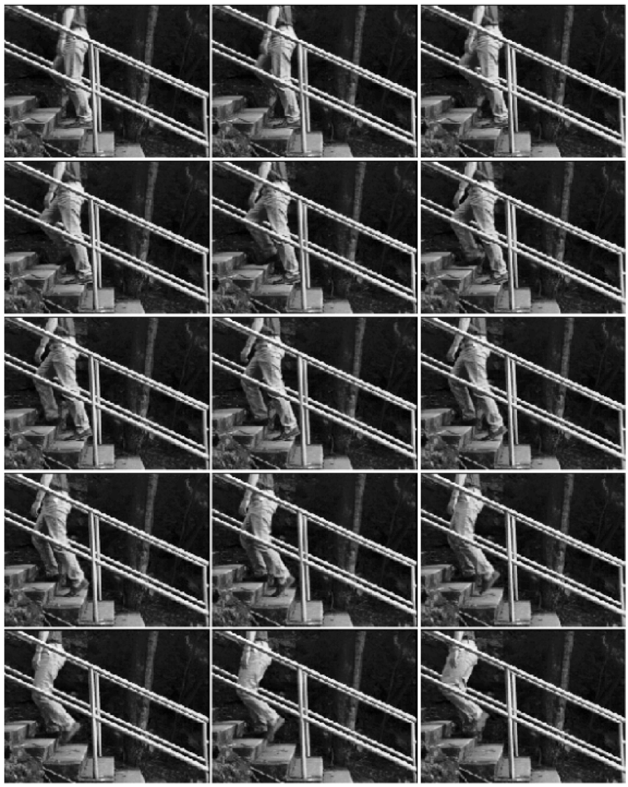

# APPENDIX A: DIGITIZED VIDEOTAPE FRAMES USED FOR DATA ACQUISITION

(IMAGE MISSING)

Figure A-1: Walking gait, frames 1-12

Figure A-2: Walking gait, frames 13-27

Figure A-3: Walking gait, frames 28-35

Figure A-4: Running gait, frames 1-15

Figure A-5: Running gait, frames 16-26

Figure A-6: Climbing gait, frames 1-15

Figure A-7: Climbing gait, frames 16-30
