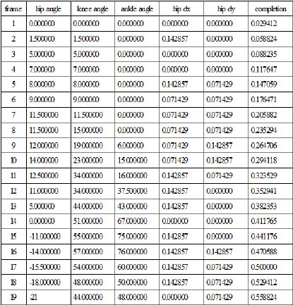
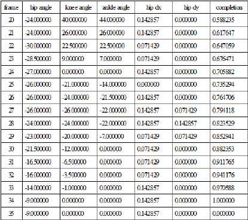
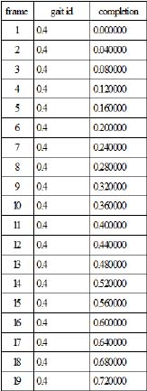
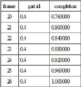
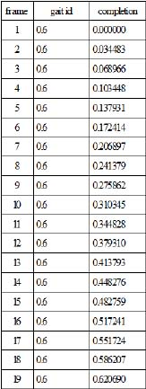
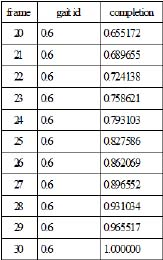

# APPENDIX B: DATA USED TO TRAIN THE KOHONEN NETWORK

Table B-1: Input patterns for competitive layer of network, walking gait

Table B-2: Input patterns for competitive layer of network, running gait

Table B-3: Input patterns for competitive layer of network, climbing gait

Table B-4: Input patterns for output layer of network, walking gait, frames 1-19

Table B-5: Input patterns for output layer of network, walking gait, frames 20-35

Table B-6: Input patterns for output layer of network, running gait, frames 1-19

Table B-7: Input patterns for output layer of network, running gait, frames 20-26

Table B-8: Input patterns for output layer of network, climbing gait, frames 1-19

Table B-9: Input patterns for output layer of network, climbing gait, frames 20-30
