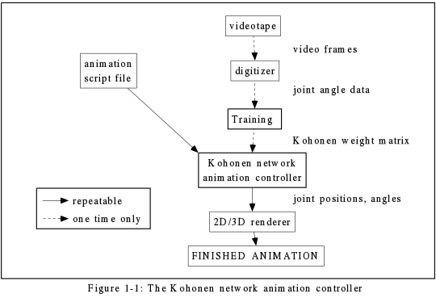

# CHAPTER 1 - INTRODUCTION

Computer animation has become prevalent in modern society.  Aside from its use in entertainment, there are many other uses in fields as diverse as architecture and medicine. One interesting problem in computer animation has remained: the control of articulated human motion, especially locomotion.

There are several techniques now used to animate human locomotion.  Explicit control and keyframing are methods of low-level control, while dynamic and kinematic approaches put more of the workload on the computer instead of the animator. However, none of these approaches has achieved the balance between realistic results, ease of use, adaptability, and speed.

A natural model for the control of locomotion is the human brain.  Although not fully understood, enough is known to create models of brain function known as neural networks.  In particular, the neural network proposed by Teavo Kohonen is useful in animation control since the input data are organized topologically in a manner similar to the way the brain organizes input and output (Ritter et al. 1992).

The animation control system written for this thesis forms the basis for what could become a complete motion library for the human articulated figure, and could also be adapted for animation of the movements of animals.  The system itself has no graphical input or output, but it produces data which can easily be imported into a rendering program.  Figure 1-1 displays the components of the animation system.

The animation system is composed of two main programs: the training program and the controller program.  The training program accepts a set of input data obtained from measurements of human locomotion and trains a Kohonen network using the data. The program then outputs a data file containing the weights of the Kohonen network.

The controller program accepts the data file containing the weights of the Kohonen network and an accompanying animation script file.  This program outputs a data file which contains the information relevant to the motion.  In the case of human locomotion, this includes the change in x and y position of the center of the hip joint and the joint angles of the leg.  These data can be given to a rendering program in order to produce a realistic animation, or a rendering program could be built around the controller to produce real-time animations (assuming rendering is fast enough).
