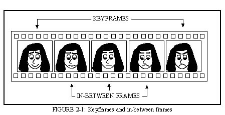
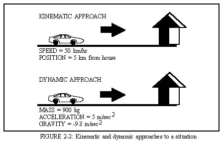

# CHAPTER 2 - ANIMATION

Animation is the process of bringing a sequence of still images to life by rapidly switching between them.  Although this implies that the result is a moving image, as is usually the case, animation concerns any change with a visual effect, such as color cycling. Animation is widely used, especially in the entertainment industry where motion pictures, television shows, and television commercials rely on animation techniques. Another important use of animation is for the simulation and visualization of scientific processes, such as air flow around an automobile.

##Conventional Animation

Traditionally, animation has been accomplished through a process known askeyframe animation.  In this process, first the important, or key, frames of the animation aredrawn by a senior animator.  Then the assistant animators complete the task of filling in thein-between frames, in a process known as in-betweening or "tweening" (see Figure 2-1). 

The completed frames, usually drawn in pencil, are photographed and previewed asa pencil test.  Final changes are made if necessary, then the frames are copied ontoacetate sheets known as cels.  The cels are colored and photographed against backgroundscenes to produce the final animation.

##Computer-Assisted Animation

Recently, computers have become more commonplace in traditional animation.The pencil drawings can be digitized and previewed on the computer instead ofphotographing
a pencil test.  Once digitized, the drawings can easily be colored on the computer,combined with two- or three-dimensional backgrounds, and output digitally to film orvideotape.  These advances have sped up the animation process and made possible thenumber of animated motion pictures and weekly animated television programs.

##Computer Animation  

Although very useful in assisting traditional animation, computers are capable ofproducing complete animations.  A computer animator defines objects in a scene in termsof three-dimensional coordinates, specifies object motion, camera motion, lightingand textural conditions and the computer produces the animation, one frame at a time.  Thisis a processor-intensive task, and as a result a complete animation may take hours or daysto render, depending on the complexity and size of the animation, the renderingalgorithm, and the speed of the computer.  The advantage to this process, however, is that oncethe scene is defined, the computer does all of the tedious work required in renderingthe frames.  The in-between frames are usually generated using a scheme such asspline interpolation, where a cubic or higher order spline is used for the in-betweening,producing very realistic results.

###Explicit Control

A variety of techniques are used to control objects in a computer animation.  Themost obvious is explicit control of all objects in a scene at all times.  This is similar totraditional animation techniques.  The problem with this approach is that positions of all objectsmust be specified for all frames, which puts most of the workload on the animator and noton the computer.  Of course, more control of the resulting animation is possible, butthis method is not usually desirable because of the amount of work involved..

A process related to explicit control is that of rotoscoping (Foley et al. 1990).With this method, a film or videotape of live actors performing a specific motion isbroken down into individual frames.  Animators then draw over the live action frames in orderto approximate the natural movement. This produces realistic results, as would be expected. Another related technique is to track indicator points which have been affixed toan actor's body at key points, usually at joints.  The positions of the key points arerecorded by the computer and used to form a two- or three-dimensional image of the action.

###Procedural Control

Procedural control is widely used for animations in which the interaction of objects ina scene determine their movement (Foley et al. 1990).  Particle systems are aprocedural technique and are typically used for modeling processes such as rain, fireworks, and wind. These processes involve a collection of particles whose behavior over time can beexpressed mathematically.

###Constraint-based Control

If physical laws or other constraints are placed on objects in a scene, this is knownas constraint-based modeling.  Specifically, if physical laws are applied to objects, thetechnique is referred to as physically-based modeling (Foley et al. 1990).  Kinematicsand dynamics are components of physically-based modeling.  Kinematics involves thepositions and velocities of bodies.  Dynamics takes physical laws, such as Newton's laws ofmotion, into account.  Figure 2-2 illustrates a kinematic and dynamic approach to a singlesituation, that of a car heading toward a house.  The kinematic approach is concerned withthe speed of the car and its position from the house, while the dynamic approach involvesthe mass and acceleration of the car, and the forces acting on it such as gravity andwind resistance.  Dynamics and kinematics can be inverted;  the resulting modelingapproaches are termed inverse dynamics and inverse kinematics, respectively.  For example, aninverse kinematic approach to the situation in Figure 2-2 might be to find how fast the car must travel to reach the house in 20 minutes if the house is 5 miles away.  

An inverse dynamic approach to the same situation would be to find the constant acceleration necessary for the car to reach the house in 20 minutes if the house is 5 miles away.  The problem with inverse kinematics and dynamics is that there may be several solutions to any specific problem.  For example, if a person wants to touch their nose, there are many possible ways to bring the hand to the nose.  The most obvious is a direct path to the nose, but a person may also opt to make a wide arm motion before touching the nose.  In such a case, constraints on the movement, such as minimizing energy expenditure, help reduce the complexity of the problem.  Generally speaking, a dynamic approach to animation produces much more realistic results than a kinematic approach.

The control of animations involving articulated figures is a special problem in computer animation. Several techniques, all of which are variations of those in this chapter, have been used to control articulated figures.

