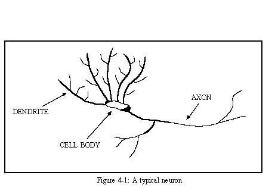
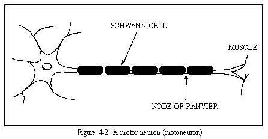
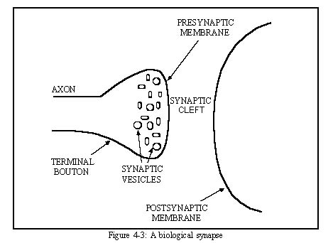
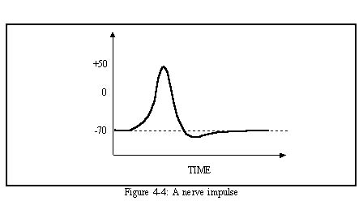

# CHAPTER 4 - NERVE CELLS

The nerve cell, or neuron, is one of the characteristics distinguishing animals fromplant life.  The human brain is composed of an estimated 10-500 billion neurons, which rangein dimension from cellular size to 3 meters long.    These neurons are thought to bearranged into 1000 main modules, each with about 500 neural networks.  Thus, eachnetwork would contain approximately 100,000 neurons.

##Structure

There are at least 200 distinguishable types of neurons in the human body, withdifferences due to size and shape.  Although there are different types of neurons, they allhave basically the same structure, shown in Figure 4-1.  The three main parts of a neuron are the cell body, axon, and dendrites.

##Cell Body

The cell body, or soma, is the main part of the cell.  The nucleus, which carriesgenetic information and directs cellular metabolism, is contained within the cell body.  Alsowithin the cell body are other organelles necessary for cell metabolism and protein synthesis. Emanating from the cell body are the dendrites and axon.

##Dendrites

Dendrites are relatively short, highly branched structures that receive nerve signalsand carry them to the cell body.  The branching of dendrites is often complex and formsa structure known as a dendritic tree.  The shape of the dendritic tree reflects the functionof a particular neuron.  A large percentage of a neuron's volume is often a result ofthe dendrites.

##Axon

The axon carries nerve impulses away from the cell body.  The axon connects tothe cell body at a point called the axon hillock.  Although a typical neuron has only oneaxon, the axon may connect to anywhere from one hundred to several thousand neurons dueto branches in the axon known as collaterals.  Due to this, neurons have been found tofollow Eccles' law, which states that each neuron either excites or inhibits all neurons to whichit contacts.  Along many axons are usually found Schwann cells, which form acoating around the axon known as a myelin sheath (see Figure 4-2).  

Each Schwann cell coats only a small length of the axon, so many such cells are needed to cover an entire axon.The gaps between the Schwann cells are called nodes of Ranvier.  The myelin insulation ofthe Schwann cells produces resistance to ionic flow, so in effect the impulse jumps fromnode to node, a process known as saltatory conduction.  This greatly speeds up the rateof transmission in long axons.  This is especially important in spinal motoneurons, in which the axons may be very long because they reach all the way from the cell body in thespinal cord to the muscles they affect.

##The Synapse

The ends of the axon connect to other nerve cells via synapses, which aremicroscopic gaps between an axon of one neuron and a dendrite or cell body of another neuron. A synapse consists of three parts (Figure 4-3): 

1. the presynaptic area, which is usuallythe terminal point of the axon (called a synaptic bouton), 
2. a synaptic cleft, which isthe space between the pre- and post- synaptic membranes, and 
3. the membrane of adendrite or cell body, called the postsynaptic membrane.  

When a nerve impulse reaches thesynaptic bouton, this triggers the release of chemicals from structures in the boutoncalled synaptic vesicles.  The synaptic vesicles store chemicals known as neurotransmittersuntil they are needed.  The neurotransmitters enter the synaptic cleft and cross over tothe postsynaptic membrane, which effects changes in the target neuron.  These changesmay be inhibitory or excitatory depending on the particular neurotransmitter.  Because ofthe chemical interactions involved, synapses are susceptible to fatigue, oxygen deficiency,and chemical agents such as narcotics and anesthetics.

##Nerve Signal Propagation

The cell membrane of a neuron acts like a capacitor in that there is an electricpotential between the inside and outside of the cell.  Neurons have a resting state of -70 mV,known as the resting potential.  The resting potential is negative mainly due tonegatively-charged proteins which are unable to exit the cell.

Ions move in and out of a neuron through microscopic holes in the cell membrane. The primary types of ions involved are sodium(Na

All of the signals reaching a neuron have different strengths and are said tobe weighted.  The signals may be excitatory or inhibitory, in that they either hyperpolarizeor depolarize the cell membrane.  If the cell membrane reaches a certain threshold, calledthe action potential, a nerve impulse is started (see Figure 4-4).  The triggering of animpulse is an all-or-none response, that is, there are no partial nerve impulses.  The impulseusually starts at the axon base and travels down the axon to all connected neurons.  The rateof travel is fast; impulses may travel anywhere from 3 to 300 km/hr.  A nerve impulse is the result of rapid transit of Na.

Historically, many neural network models have been loosely based on the principlesof nerve signal propagation.  Specifically, the summing of inputs to a unit in a neuralnetwork is similar to that in nerve cells, as is the resulting output if a certain threshold valueis reached.  The following chapter traces the development of neural network models.

MEMBRANE POTENTIAL (meV)
