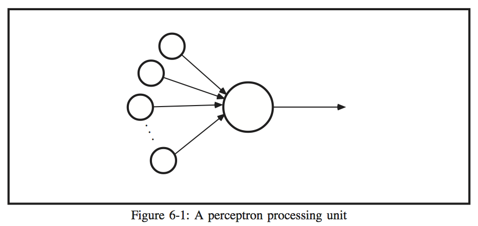

# CHAPTER 6 - NEURAL NETWORK MODELS

##The Perceptron

The perceptron model is a pattern-mapping neural network which utilizes supervised learning. Supervised learning means that for each input to the network, a teacher must provide the correct output. The perceptron is a simple model, with two layers of processing units and one or more layers of weights between the processing layers. Only one of the weight layers may be adaptive, however. This limits the usefulness of the model.

Figure 6-1 shows a basic perceptron processing unit. The binary inputs are presented to the perceptron as a vector, a. Each element of the input vector is multiplied by an associated weight value, wji, and the products are summed over all inputs. The sum has the following form:

where
is the value of input i

= the weight associated with the connection to unit j from unit i

A bias term (represented as  in Figure 6-1) is included in the sum, and has aweight associated with it as well.  The bias term is always +1, which provides a threshold for the perceptron.

The output of the perceptron unit is determined by looking at the sum Sj. The output is 
