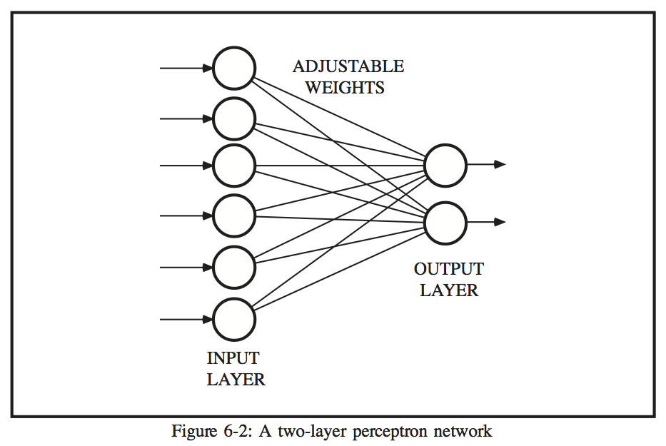
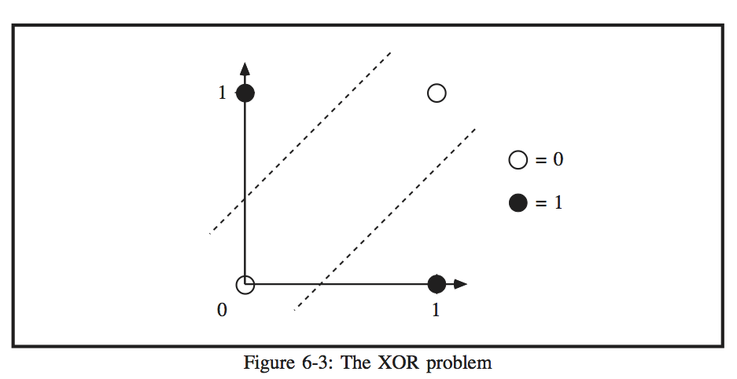
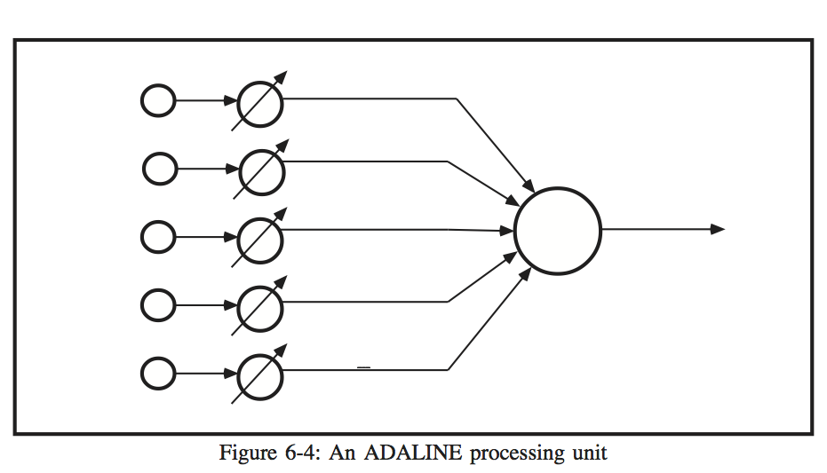
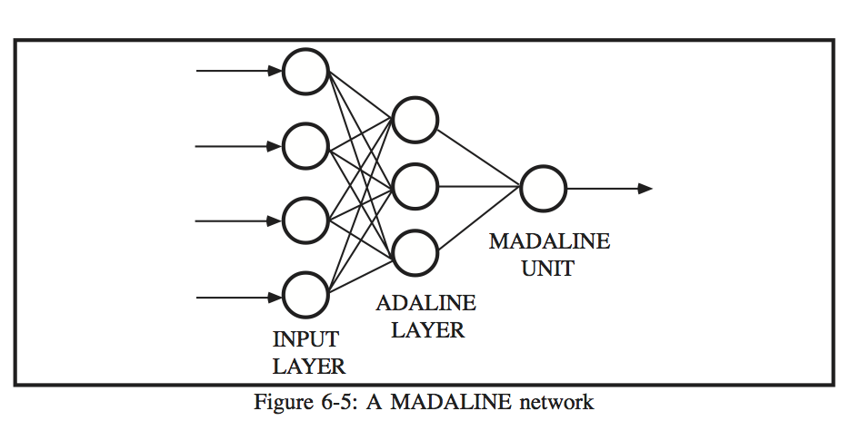
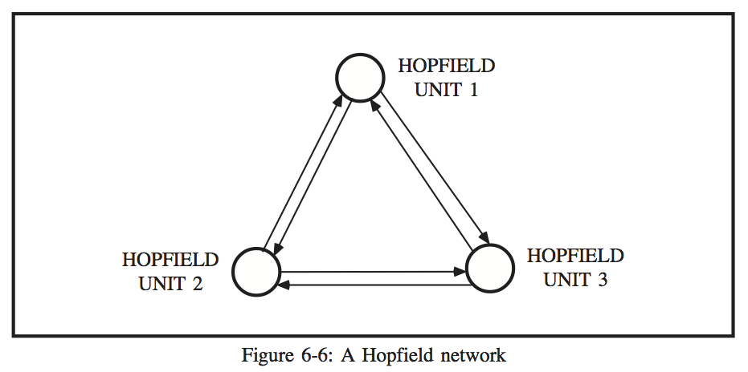
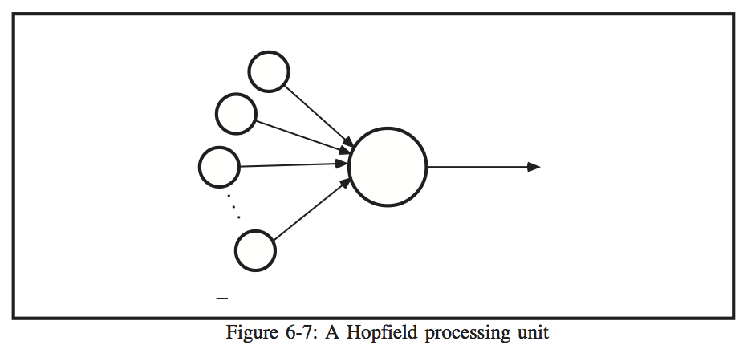
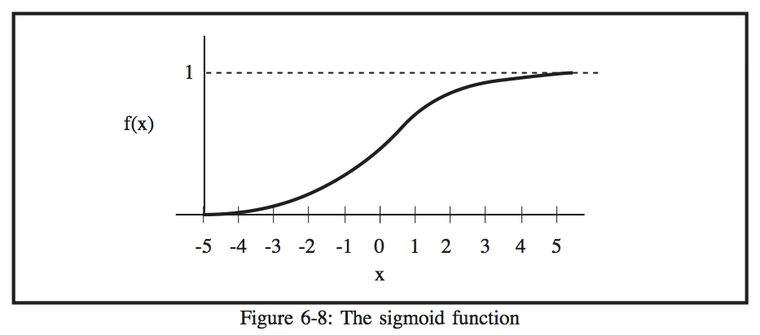

# CHAPTER 6 - NEURAL NETWORK MODELS

##The Perceptron

The perceptron model is a pattern-mapping neural network which utilizes supervised learning.  Supervised learning means that for each input to the network, a teacher must provide the correct output.  The perceptron is a simple model, with two layers of processing units and one or more layers of weights between the processing layers.  Only one of the weight layers may be adaptive, however.  This limits the usefulness of the model.

Figure 6-1 shows a basic perceptron processing unit.  The binary inputs are presented to the perceptron as a vector, a.  Each element of the input vector is multiplied by an associated weight value, wji, and the products are summed over all inputs.  The sum has the following form:

where

 is the value of input i
 = the weight associated with the connection to unit j from unit i

A bias term (represented as  in Figure 6-1) is included in the sum, and has a weight associated with it as well.  The bias term is always +1, which provides a threshold for the perceptron.

The output of the perceptron unit is determined by looking at the sum Sj. The output is found by using a hard threshold function on the sum, which is as follows:

A two-layer perceptron is shown in Figure 6-2.  The input layer simply assumes the value of  each input as it is presented.  Each unit in the output layer performs the computations described previously.  The two layers are fully interconnected, that is, every unit in the input layer is connected to every unit in the output layer.

The weights of a perceptron may be updated in several ways, but a simple rule is to use the difference between the target output and the network output as a measure of the error and adjust accordingly.  Thus
 

where

 C =a constant from 0-1 (the learning rate)
 =the target output minus the network output
 =the value of input unit i

The input patterns are repeatedly presented to the input layer, and the weights are adjusted as necessary.  The training may be stopped after a certain number of repetitions, but this does not guarantee convergence of the network.  A more reliable estimate of the success in training the network is by looking at the RMS error value of the output units, computed as

 
where

= number of patterns in the training set
 = number of units in the output layer.

A severe limitation of the perceptron model, as mentioned earlier, is the presence of only one layer of adaptive weights.  This prevents the network from classifying patterns that are not linearly separable.  A classic example of this is the XOR problem, illustrated in Figure 6-3.  The two classes cannot be separated by only one line, so two lines must be used to successfully separate the classes.

ADALINE stands for ADAptive LInear Neuron, which emphasizes both the adaptive nature of the model and the resemblance to a biological nerve cell.  The ADALINE model is similar to the perceptron in the way it operates, perhaps due to the fact that Frank Rosenblatt, the creator of the perceptron, was in contact with the creators of the ADALINE.  The MADALINE (Multilayer ADALINE) is simply two or more ADALINE units connected in a network.

Figure 6-4  shows the basic ADALINE unit.  The inputs to an ADALINE unit have values of either -1 or 1, unlike the perceptron whose inputs are 0 or 1.  The inputs are presented to the input layer, which simply assumes their values and outputs them.  

The processing unit performs a weighted sum on the values of the input units:

where

=the output value of input unit i
 = the connection weight from input i

Like the perceptron, the ADALINE has a bias unit set to +1 (represented by  in Figure 6-4), with an associated connection weight.  The ADALINE unit has a hard threshold function, which is as follows:

The weights of the network are adjusted in a similar way to the perceptron, using the Widrow-Hoff learning rule:

where
 = a learning constant
 = output of unit i
      t = target output
      x = output of ADALINE

The MADALINE system consists of a layer of ADALINE units connected to an MADALINE unit, as shown in Figure 6-5.  Each unit in the input layer is connected to every unit in the ADALINE layer and each of these connections has an associated weight value.  Each unit in the ADALINE layer is connected to the MADALINE unit, but there are no weights associated with the connections.  

The MADALINE outputs a 1 if more than half of the ADALINEs output 1, and a -1 if more than half of the ADALINEs output -1.  The weights connecting to the ADALINE layer are adjusted only if the MADALINE output does not match the target.  If it does not match, the weights connecting the input layer with the ADALINE unit whose sum was closest to zero in the wrong direction are adapted.

The ADALINE and MADALINE models share one important disadvantage with the perceptron: they are unable to classify patterns that are not linearly separable.  However, these models have been applied to real-world problems whereas the perceptron has been used more as a theoretical model.

Hopfield neural networks were proposed by John Hopfield, a physicist at Cal Tech and at AT&T Bell Labs.  The networks were developed as a result of research into the neurophysiology of garden slugs (Nelson and Illingworth 1990).

A Hopfield network consists of one layer of  processing units.  The units are fully interconnected, that is, each unit is connected to all other unit in the network (see Figure 6-6).  

As a result, the connections are somewhat redundant because between any two arbitrary units there are two connections, one going each way.  The state of each unit is binary, with a value of either 0 or 1 (-1 and 1 can also be used with minor changes in the equations).  If all of the states of the individual units are grouped into a vector, the result is the state of the network, U=.  Figure 6-7 shows a Hopfield processing unit.

Each connection between units has an associated weight value, which represents the strength of the connection.  Because of the redundancy of the network, the two weight values between any two neurons are the same.  Thus, if wij is the weight value of the connection between neuron i and neuron j,

Mathematically, this equality allows the network to converge to a solution (Dayhoff 1990).

A Hopfield network is not trained in the traditional sense, but instead the initial weight values, expressed as the matrix W, are assigned using the input patterns, designated by A1,A2, ..., Am.  The assignment is as follows:

where

 = the ith entry in pattern vector p.

Once the weight matrix W is formed, the output of the Hopfield network is found in the following manner.  The state vector U is set to assume the values of an input pattern vector.  Each unit of the network performs a weighted sum on the states, as follows:

The sum is passed through a hard threshold function, which produces the following output:

The output of each unit is stored in the state vector U.  When all units have finished processing, the vector U contains the output of the network, which is the new state of the network.  The output given by the network may not converge to the desired output on the first presentation of the input, so the process is repeated using the new state vector U as the new input to the network.  This process usually reconstructs the desired output within five feedback cycles.

In 1984, Hopfield expanded his network model to allow for continuous input.  The inputs, previously binary, could then be a continuous value from 0 to 1.  The major difference in the network operation was the addition of a sigmoid threshold function which is used instead of the hard threshold function of the binary version of the network.  The sigmoid function is shown in Figure 6-8 and is defined as follows:

The result of using this function is that there is a more smooth transition between the output values of 0 and 1 due to the differentiability of the function.  If an input to the threshold is highly positive or negative, the output is close to 0 or 1, respectively.  With an input to the threshold close to 0, the output rapidly rises from 0 to 1.

Hopfield networks are useful for recall of partial or noisy images, and are easily developed into hardware.  However, there are severe limitations.  The patterns to be stored must not be too similar, or the network will not converge to a correct solution.  The number of storable patterns is only about 15 percent of the number of neurons in the network.  The network may converge to a solution which is not the closest to the input pattern.  Finally, sometimes the network may produce as output spurious states, states which were not part of the training patterns.

The most widely used neural network model is the back-error propagation network, or backpropagation network.  Backpropagation networks learn using a rule known as the gradient descent rule, which seeks a minimum in the error of the network.  The backpropagation network has at least two layers of neurons, an input and an output layer.  Between these two layers may be any number of hidden layers, which give the backpropagation network an advantage over the perceptron, which could only learn linearly separable patterns.  The hidden layers act as feature detectors, which respond to special features in the input patterns.

Each unit in a backpropagation network is usually fully interconnected to the units in the layers surrounding it, although this need not be the case (see Figure 6-9).  The network is trained in two steps: a forward propagation step and a backward propagation step.

The forward propagation step starts when the input pattern is presented to the input layer.  The neurons in the input layer assume the values of the input pattern.  These input values become the output values, known as activation values, for the input layer.  The activation value for each unit in the succeeding layers is found by performing a sum of the products of the activation values of the units going into it and their associated weight values in the following way:

This sum is not necessarily within the range between 0 and 1, which is necessary for propagation to the next layer.  Therefore, a squashing function is used to scale down the sum.  A common squashing function is the sigmoid function described previously.  After the sigmoid function is applied to the sum, the result is the activation value for the unit and has a value between 0 and 1.

When the input pattern has been propagated forward to the output layer, the resulting pattern is compared to the expected output and the error is found for each unit in the output layer as follows:

where

=the target value for unit j
=the output value of unit j
= the derivative of the sigmoid function
=the weighted sum of all inputs to j

The derivative of the sigmoid function, f'(x) is shown in Figure 6-10.  The function has the form:

The purpose of the derivative of the sigmoid function in the error formula is to suggest a stronger correction if the weighted sum of the inputs to the output unit is near zero.

The error values for the units in the hidden layers are found next.  The weights are updated using the rule:

This formula is a bit more complicated than the one for the output layer, but a unit in the hidden layer must take into account the error values of units receiving input from the hidden unit.  When all of the error values have been found, the weights in the network are updated using the formula:

A backpropagation network is trained until the RMS error value falls below some user-defined threshold which depends on the application.  Convergence can potentially take a long time, and it is possible for a network not to converge to an acceptable solution.  In addition, the backpropagation model is not biologically accurate, for although biological neurons do perform summation of inputs to a neuron, no evidence of a process similar to backpropagation has been found in biological systems.

The self-organizing paradigm puts an emphasis not on the connections between processing units, as the preceding models have done, but instead on the location of a unit within a layer.  Thus, the goal for self-organizing networks is to optimize the spatial distribution of the responses of units within a layer (Ritter el al. 1992).  When this goal is realized, topographic maps form which contain spatial information about the input signals.

Generally, self-organizing maps are biologically based and evidence has shown that their function is much like that of biological systems, such as sensorimotor maps in the brains of mammals.  Kohonen (1986) generalized the self-organizing model to make it easier to implement on a computer.  His self-organizing neural network model was the basis for this thesis and is explained in detail in the following chapter.

