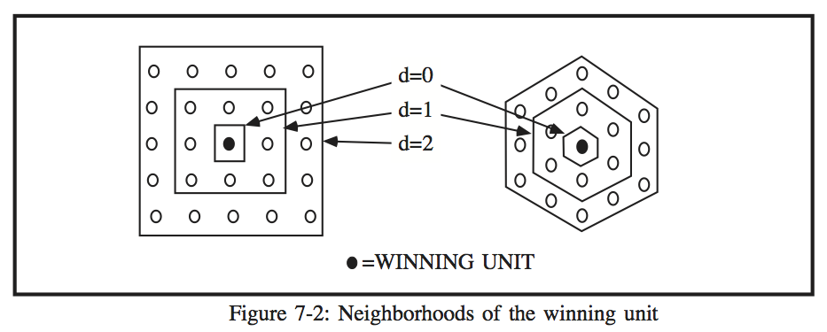

# CHAPTER 7 - KOHONEN SELF-ORGANIZING NETWORKS

One neural network model which is based on biological neural networks is the self-organizing network, proposed by Teavo Kohonen of the Helsinki University of Technology. Although the model is based on biological systems, it is not completely faithful for the brain is organized in a much more complicated manner than the Kohonen network, input patterns are not the same in biological systems, and the interconnection between neurons in biological systems is much more complex. However, the basic idea of organizing inputs into a topological ordering is successfully achieved by the Kohonen network. 

Kohonen's self-organizing network has two layers: an input layer and a competitive layer. Each element of the input layer is connected to every element of the competitive layer (see Figure 7-1). 

The competitive layer is usually a two-dimensional grid, either rectangular or hexagonal. Each connection has an associated weight value, specified by

where i is a unit in the competitive layer.

Each connection weight has a continuous value between 0 and 1. Before the network is trained, the connection weights must be initialized. This is typically done by setting each weight to a random value between 0.45-0.55.

The operation of a Kohonen network begins when an input pattern E={e1,e2,...,en} is presented to the input layer, which assumes the values of the input pattern. The input layer is compared to each unit in the competitive layer by comparing the input pattern vector and the associated weights connecting to the competitive unit. This value is denoted as

and signifies the amount of agreement between the vectors E and Ui. This value, known as the Euclidean distance, is computed as:

^2 + (E_2 + U_i_2)^2 + ... + (E_n + U_i_n)^2}")

The unit with the minimum Euclidean distance is known as the winning unit, and is denoted by c.

After the winning neuron is found, its neighborhood must be determined. The neighborhood, designated by Nc, consists of the winning unit and the units in the competitive layer which surround the winning unit in a configuration identical to the topology of the competitive layer. Figure 7-2 shows the neighborhood for a rectangularly and hexagonally organized network. 

The winning unit is black in the figure, and is surrounded by neighborhoods of different sizes. The neighborhood shrinks as the network is trained. The decrease in the neighborhood size is determined by the equation:

where

d is the distance from c to the edge of the neighborhood
 is the original distance between c and the edge of the neighborhood
t is the current training iteration number
T is the total number of training iterations.

The total number of training iterations, T, must be known before training the network. Typically this number depends on the number of input patterns, and must be found by trial and error. An insufficiently low value for T will produce a topological mapping which is not similar to the input patterns, while an excessive value will prolong the training phase while not improving the results.
 
The units in the neighborhood must be updated after the neighborhood is determined. There are several possible ways to update the neighborhood, as shown in Figure 7-3. 

The first method, called the Mexican hat function, is similar to the on-center off-surround property of biological neurons (Eberhard and Dobbins 1990b). The winning unit is updated the most, and as the distance from the winning unit increases the amount of update decreases until it reaches zero. Nodes further still are updated in a negative direction, until a certain distance from the winning unit there is no update. This function is computationally complex to implement, so an approximation is the second function, the stovepipe hat function. Kohonen found, however, that there was no significant difference in using the stovepipe hat function and the third function, the chef's hat function, which is the simplest to implement. Using the chef's hat function, the neighborhood is updated using the equation

where

 if i is in the neighborhood Nc
0 otherwise

The parameter is the learning rate parameter, which, like the neighborhood, decreases during training. Typically, the learning rate starts at a value around 0.5 and decreases to 0 during the training phase using the equation

where

 is the initial value of a
t is the training iteration number
T is the total number of training iterations.

The value of a usually varies with the shape of the update function, but since the chef's hat function updates the same despite the distance from the winning unit, a does not need to vary according to the distance from the winning unit.

A Kohonen network was trained in order to illustrate how the network accomplishes topological ordering. There were 1000 input patterns, shown graphically in Figure 7-4. Each input pattern consisted of two numbers selected randomly from a uniform distribution between 0 and 1, shown on Figure 7-4 as an x-y pair. 

The network consisted of a two-unit input layer and a sixty-four unit competitive layer, organized in an 8x8 configuration. The initial value of a was 0.2, and the initial neighborhood size was 4. After a total of 20,000 presentations of the input patterns, the network organized itself as shown in Figure 7-5. Units on the competitive layer that were adjacent to each other were connected with a line. The figure suggests that the network was successful in mapping the input, since the resulting map attempts to occupy the entire domain of the input patterns. There is no traditional way to test convergence, but resemblance of the competitive layer to the original imput patterns is a good indicator.

The dimensionality of the input layer and the competitive layer need not be the same, however. For example, Kohonen networks can also map two-dimensional input into a one-dimensional configuration. The same input patterns were used to train the network and the same number of nodes were present in the competitive layer, but the neighborhood was linear instead of rectangular as was the case with Figure 7-4. In addition, the initial neighborhood size was 14 and there were 60,000 presentations of the input patterns. 

As Figure 7-5 shows, the mapping produces a line in the 2-d plane which attempts to fill all of the available area. This is reminiscent of a Peano curve, a type of fractal curve proposed by Guiseppe Peano.  

A fractal, according to Mandelbrot (1983), is a geometric figure whose topological dimension does not match its Hausdorff-Besicovitch dimension. In this case, the one-dimensional line formed by the competitive units attempts to pass through every point in the input pattern set, thus achieving a Hausdorff-Besicovitch dimension greater than its topological dimension of 1. The success of this is limited by the number of competitive units, which is far less than the number of input patterns. The fractal nature of the organization of Kohonen nets has been found in mammalian brain folds (Mandelbrot 1986). The cerebral cortex is basically a two-dimensional sheet of neurons, but it folds in such a way that it fills up a majority of the volume of the cranium. The exact mechanism behind this is unknown, but perhaps a process of self-organization such as that in the Kohonen model is at work in the brain.

[Chapter 8 -->](./ch08.md "Chapter 8 -->")

