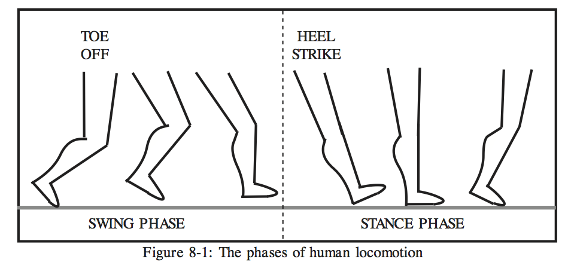

# CHAPTER 8 - NEURAL CONTROL OF LOCOMOTION

The locomotion of all animals involves a rhythmic movement of either the entire body or certain specialized parts of the body. In humans, locomotion involves the legs and to a lesser extent the arms (for balance).  Human locomotion is a well-documented activity, with data coming from a variety of disciplines.

##Analysis of Locomotion

Human locomotion can be divided into two major phases, as seen in Figure 8-1. One phase of locomotion is the swing phase, during which the foot is off the ground.The swing phase includes the time between when the toe leaves the ground and when theheel touches the ground.  

The other phase of locomotion is the stance phase, during whichthe foot is in contact with the ground.  This stage includes the time between when the heelof one leg touches the ground and the when the toe of that leg leaves the ground.  Each leg alternates between the swing and stance phases in a repetitive fashion.  The two phasesare shifted in time between the two legs during locomotion, so that when one leg is inthe stance stage, the other leg is in the swing phase, and vice versa.  The amount of overlap of the two phases among the legs determines the speed of locomotion and whether the gaitis a walking or running gait.  For example, as the speed of walking increases, the amountof overlap decreases, so that when running occurs,  both swing phases overlap.

## Motor Control

Motor control is the name given to the functions of mind and body that governposture and movement.  Posture, in this context, does not mean the standing or sitting positionof the entire body but the static position of any body part (Brooks 1986).
The smallest unit that can be controlled is known as a motor unit.  Each motorunit consists of  a motoneuron which innervates anywhere from 3 to 200 muscle fibers.The number of muscle fibers contained in a motor unit depends on the fineness of themovement it elicits.  Excitation of a motor unit is an all-or-nothing process, and as a resultthe only ways in which muscle tension can be increased is by increasing the rate ofstimulation or by recruiting more motor units.  The recruitment of new motor units follows arule known as Henneman's Size Principle: the size of newly recruited units depends onthe tension level of the muscle.  Thus, finely graded movements are possible.

Several areas of the brain are responsible for motor control.  These areas includethe cerebral cortex, the cerebellum, the basal ganglia, the brain stem, and the spinalcord (Figure 8-2).  Each of these areas has a different role, although their exact roles arenot known in detail.

The areas of the cerebral cortex most associated with muscle movements are the motor cortex and the nonprimary motor cortex (Figure 8-3).  The motor cortex contains motor maps for every part of the body.  Early researchers stimulated areas of the motorcortex and were able to produce movement in the corresponding body area.  Some parts of the body which require more detailed control, such as the hands, have larger areas of the motor cortex devoted to their maps.  The nonprimary motor cortex lies adjacent to the motor cortex in the frontal lobe.  The nonprimary motor cortex consists of two main regions: the supplementary motor cortex and the premotor cortex.  The supplementary motor cortex receives input from the basal ganglia,  and is important for organizingand planning fairly complex movements and for adapting motor responses to sensory stimuli. The premotor cortex receives input from the cerebellum, and is important in controlof visually guided movements.

The cerebellum is a structure in the lower rear part of the brain.  It receives inputfrom sensory systems as well as other brain motor systems.  Inputs contain vestibularinformation, muscle and joint information, and somatosensory, visual, and auditory information. There is a great deal of information processing that takes place in the cerebellum, forthe ratio of inputs to outputs is about 40:1.  A somatotrophic organization exists in the cerebellum, similar to that of the primary motor cortex.  The cerebellum seems to act as a center for feedback control of motor movements, and performs neural programsfor control of skilled movements.

The basal ganglia consist of several forebrain nuclei and some major brain stemstructures.  These include the caudate nucleus, putamen, and the globus pallidus, as well asthe substantia nigra and subthalamic nucleus.  Within each of these structures is atopographic map of the body's musculature.  The function of the basal ganglia is not fullyunderstood, but research suggests some possibilities.  One is that the basal ganglia aid in theplanning phase of a movement.  Another is that they enable automatic performance ofwell-rehearsed movements by using motor programs located in other parts of the brain (Brodal 1992).  Finally, it is thought that the basal ganglia contribute to the speed of movements.

##Locomotion Control in Animals

Locomotion is a process which is apparently controlled in animals by subcorticaland spinal areas of the brain, and does not require direct use of the cerebral cortex.  This is not to say that the cortex is totally uninvolved in locomotion, for it sometimes interacts with the main areas of locomotion control.  The localization of locomotion control in the spinal and subcortical regions of the brain has been observed in cats in which the spinal cord has been disconnected from the brain. In these animals, walking patterns can be elicited if, for example, the animal's body weight is supported over a treadmill.

The spinal cord controls locomotion in animals by using what are known ascentral pattern generators (CPGs).  The CPGs are thought to consist of a complex network of interneurons, neurons which have short axons with a multitude of branches close to the cell body.  These interneurons have both inhibitory and excitatory interconnections, and eventually control the motor units.  In addition, some of the interneurons are able to fire rhythmically and repetitively without an external input.  The generation of the locomotion patterns is still somewhat of a mystery, since little is known about the connections of spinal interneurons.

Central pattern generators were long thought to be responsible for locomotion in humans.  However, recent studies have shown that the model is somewhat lacking (Patla 1991). This is because there has been no conclusive evidence that locomotion can be triggered in humans or other primates by stimulating the spinal cord electrically or pharmacologically.  In fact, it is thought that in humans and other primates other areas of the brain dominate spinal mechanisms.

An alternative to the CPGs in humans is known as the motor program.  A motor program is a set of motor output patterns which can be stored and retrieved as necessary. These motor programs can be altered by the other supraspinal motor areas of the brain. Figure 8-5 shows the interrelations of the motor areas of the brain and their influences on the spinal cord.  The purpose of the supraspinal control centers is not to directly control locomotion, but to alter the function of the motor programs as necessary depending on external stimuli.  For example, the cerebral cortex is necessary in order to walk on anon-level surface.  Cats whose cortex has been disconnected from the spinal cord can walkon level surfaces, but are unable to walk on slopes or uneven surfaces.  The supraspinal areas might also aid in developing the connections of the motor programs, although there is no direct evidence to support this.

To date there is no theory about the neural control of locomotion which is widely accepted as an accurate one.  The brain is a mysterious organ, and it may be sometime before even the most basic functions such as locomotion are fully understood.

[Chapter 9 -->](./ch09.md "Chapter 9 -->")

