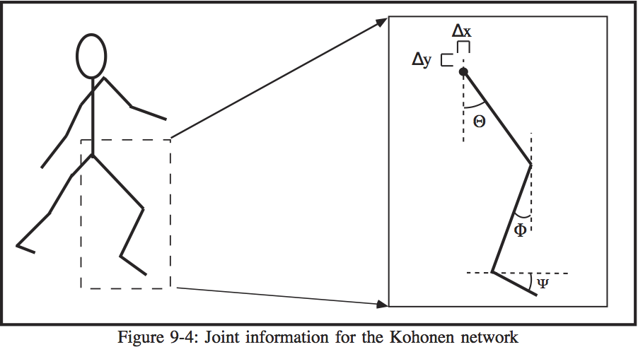

# CHAPTER 9 - THE LOCOMOTION CONTROLLER

The locomotion controller proposed in this thesis uses a Kohonen self-organizing network to organize joint information in a usable form based on neural mechanisms.In addition, the controller provides a feedback mechanism in order for the network toadapt to changing situations or a change in user commands.

##Neural Basis of the Controller

Since not much is known about the control of locomotion, the best way to simulatethe function of the brain is to model the controller after current research.  Thus, the controller has a hierarchical structure similar to that of the motor system (see Figure 9-1).  

The top level, which is the brain in the human motor system, is controlled by the animator.The input consists of specific commands (such as "walk," "run," etc.) and the duration ofthe movement in frames.  The brain sends commands to the motor system in a similarfashion, although information about the starting positions of the joints comes from sensoryinput and the duration of movements is probably not specified.  The commands are usedto activate motor programs, which are stored in a Kohonen network.  This is similar tothe topographic maps found in the cerebral cortex, basal ganglia, and the spinal cord.After the movement is initiated, control is maintained using the motor programs, whichcomplete the movement for the specified duration.

The motor programs do not form a closed-loop system, however; further input from the user (such as a change in gait) can affectthe operation of the motor programs.  This feedback mechanism is also used in thehuman motor system.
In order to understand the implementation of the locomotion controller usingKohonen networks, two assumptions must be made.  First, it must be assumed that the humanbody can be considered a machine, and that the human machine has a state associated with it at any given time.  This body state consists of all possible physical and mental variables,such as muscle tension, joint angles and positions, and mental conditions.  For simplicity, only a subset of the entire body state was used to control locomotion, containing onlythe changes in hip position and the angles of the leg at the hip, knee, and ankle.
The second assumption is that locomotion is a Markov process.  A Markov processis one which consists of a number of states, with transitions between states dependingon probabilities.  Each state has a certain amount of time associated with it as well.  

The locomotion process could instead be modeled by a finite state automaton, but a Markov process was chosen because the Kohonen network training algorithm is a Markov process (Ritter et al. 1992).  For the locomotion Markov process, a change in state occurs witha probability of 1.0, at an interval of every 1/30 second.  The states contain the joint angle/position information for a certain point in time in this case.  Since locomotion is acyclical activity, the Markov process representing any gait would be a series of states forming a circular loop, as shown in Figure 9-2.

completion
gait id
completion
gait id
completion
gait id
completion

A Kohonen network formed the basis of the locomotion controller.  The network was used to store and organize the input patterns into a usable form.   The network had 2input units and 1600 competitive units.  The competitive layer had a rectangulartopology, which was the most convenient topology for representing several Markov chains.Associated with each competitive unit was an output unit with a dimensionality of six.  Thesix values associated with an output unit were the three joint angles of the leg, the changesin the hip position, and a completion value.  The completion value was a continuousvalue between 0 and 1 which represented the percentage of completion of the next stage of the gait.  When the winning unit was found in the competitive layer, the completion valueof the associated output value was used as the next input to the network (Figure 9-3).

The input patterns had a dimensionality of 2 in order to match that of the input layer. Each input pattern consisted of a gait identifier and a completion value.  The gaitidentifier was a value between 0 and 1 that was unique for each gait.  The completion valuerepresented the percentage of completion of the gait cycle.  This value was necessary tosimulate a Markov process and to facilitate transitions between gaits if necessary.
In order to implement the walking controller, data had to be collected forwalking, running, and climbing stairs.  The controller is not restricted to these gaits, but in orderto show the capabilities of this approach these gaits were selected.  The data had tobe obtained in increments of 1/30 second, for this is usually the rate at which theanimations are output to videotape.  Since it was difficult to find preexisting data meeting thiscriterion for all three gaits, the only solution was to acquire the data from videotape.
The acquisition of the data needed to train the network was done by videotapinga subject performing the desired motions.  This method of gathering data wasselected because 1) The frames are recorded at 30 frames per second, which is the desiredoutput rate for animations, 2) it is simple and quick to videotape a subject (no specialequipment is needed other than a video camera), and 3) a video signal is a convenient source fora digitizer.  Each sequence was filmed from a side view, and a telephoto lens was usedto minimize distortion which could disrupt the accuracy of the data.
After the sequences were filmed, each gait was digitized on a frame-by-frame basis. Appendix A contains the digitized frames.  Enough frames were digitized so that oneleg goes through a complete cycle, and this number varied between gaits.  From thedigitized pictures, the important information was extracted for each frame.  Figure 9-4 showsthis information, which consisted of 1) the angle formed between a line connecting the hipand the knee and the vertical (Q), 2) the angle formed between a line connecting the knee and the ankle and the vertical (F), 3) the angle formed between a line connecting the ankleand the toe and the horizontal (Y), 4) the change in x position of the hip joint(Dx), and 5) the change in y position of the hip joint(Dy).  The angle information is specified indegrees, while the changes in hip position are specified in dimensionless units which are relativeto the length of the thigh.  To get the actual amount of change in hip position, the hip position change values are multiplied by the length of the thigh.  The locomotion information is summarized in Appendix B.

##Training

The Kohonen network was trained using the data from the digitized images.The training program accepted two files with the input patterns and correspondingoutput patterns and trained the network.  The learning constant(a) was had an initial value of 0.4, and the neighborhood size was initially 20. A total of 20,000 pattern presentations were made, and with each presentation the values of a and the neighborhood were decremented linearly.  The competitive layer was trained with the input patterns using the traditional Kohonen training algorithm.  The output layer, however, was trained ina different manner.  During each pattern presentation, when the winning unit was foundin the competitive layer, the corresponding unit in the output layer was set to the values of the training output pattern.  The neighborhood of the winning unit is not updated onthe output layer.  After training was completed, the weight values of both the Kohonen network and the associated output layer were written to a file.  The output file was used as input to the animation controller.

##The Animation Controller

The animation controller reads the Kohonen network weight values from theweight file and stores the values into a Kohonen network configuration identical to that used in training.  After this is done, an animation script is read from a script file. The animation script language is very simple, with each command consisting of a gait (walk, run,or climb) and a duration in frames.  Each gait is assigned an identifier (e.g. walk=0.2, run=0.4, climb=0.6) and this is used as one of the inputs to the Kohonen network. The other input, the starting completion value, was set to 0.0 for one leg, indicating the start of the locomotion cycle, and 0.5 for the other leg, indicating the midway point of the locomotion cycle.

The initial input is presented to the Kohonen network and the winning unit is found. The joint and position data in the unit of the output layer corresponding to the winning unit is output to a file, and the new completion value is stored along with the gait identifier as the next input to the network, and this process is repeated for the number of times specified by the script file.  If a different gait is dictated by the script file, the gait identifier is changed while leaving the completion value as it is.  In this manner transitions between gaits are made.

[Chapter 10 -->](./ch10.md "Chapter 10 -->")

