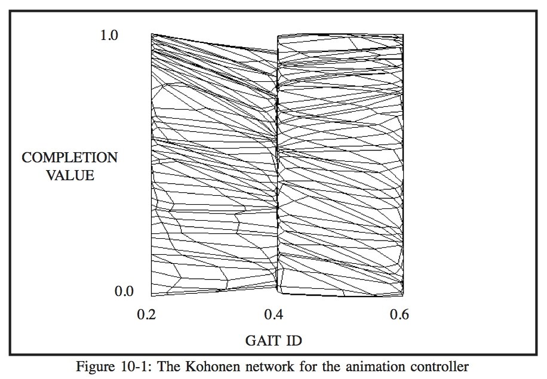
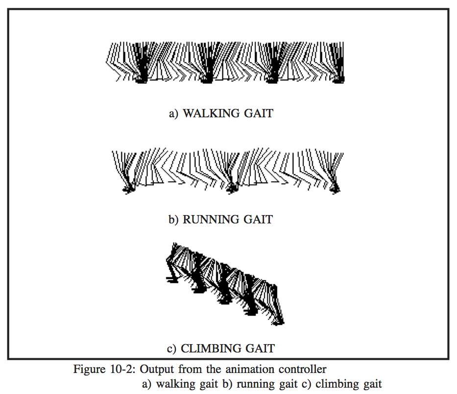
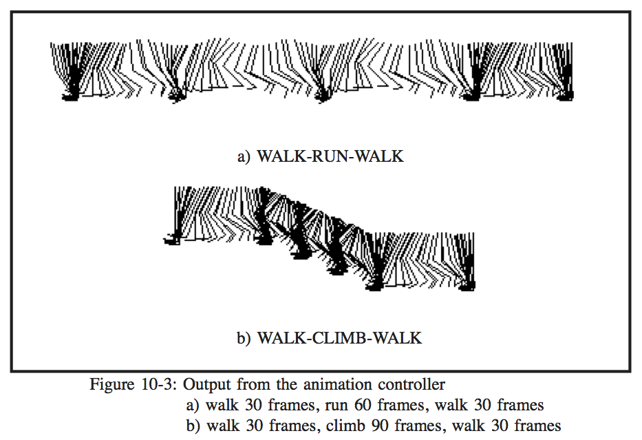

# CHAPTER 10 - RESULTS AND CONCLUSIONS

In order for the Kohonen network animation controller to be successful, the network had to be trained successfully.  The success in training the network is suggested by Figure 10-1, which shows the topology of the competitive layer of the network. The lines on the figure connect units in the competitive layer which are adjacent.  The shape of the network suggests that the network successfully learned the input patterns, since most of the competitive units have organized along the lines representing the three gait ids.  

However, it is impossible to tell by observing the figure if the output of the network will produce a correct animation sequence.  In order to gauge the success of the output, the weight values of the Kohonen network were used to animate the three gaits contained in the network.  The weight values were read by the controller program, which used themto animate sequences based on three script files.  The three script files simply containeda command to perform the walking, running, and climbing gaits for 120, 60, and 120 frames, respectively.  The results were animated in two dimensions and the resultsare displayed in Figure 10-2 as sequences of still images, with each image separated by 1/30 second.  Each of the gaits appears to have been animated correctly.  It is difficult torate the effectiveness of the controller by observing the still images in Figure 10-2, but the animated sequences appear very lifelike.  To further test the correctness of thecontroller, the sequences were rendered in three dimensions on a Silicon Graphics workstation. The results were output to videotape, and are realistic as expected.

Another feature of the controller which then had to be tested was the ability of the controller to make transitions between gaits.  Figure 10-3 shows an animation sequence produced by the controller in which a walking gait was used for 30 frames, followed by a running gait for 60 frames and finally a walking gait for 30 frames.  The transition appeared almost seamless in the animated sequence, and Figure 10-3a suggests this. Figure 10-3b shows a sequence of still images from an animation of a walking gait for 30 frames followed by a climbing gait for 90 frames and finally a walking gait for 30 frames. There was a greater degree of jerkiness in this sequence at the transitions, although this is not readily apparent in the figure.  The jerkiness is due either to signal fluctuations in the digitization, which could produce measurement errors, or errors in the angle measurements themselves.  An additional problem is due to the fact that the transition between walking and climbing may have been made at an inappropriate time, that is, the closest point in the climbing cycle to the transition point in the walking cycle was not close enough to avoid a jump.

##Conclusions

The Kohonen network locomotion animation controller is an effective way to control the animation of locomotion.  It produces realistic animations of locomotion with very little load on the CPU.  The hierarchically-based system based on the function of the brain makes it easy to produce animations using a high level script language.

##Limitations

Despite its advantages, the controller does have some limitations.  One limitation of the animation controller is a result of one of the assumptions made by the system.  The assumption that motion can be discretized into states, although feasible, can produce jumpiness in animations produced by the controller.  A possible solution is to digitize frames at a greater rate.  This would give more possible states per time unit, and thus more realistic movement.  This requires a larger network, however, which increases the time spent locating winning units as well as increases the memory requirements.  On a multiuser system this may degrade performance due to memory swapping.

Another limitation of the animation controller results from inaccuracies in gathering the locomotion data.  The means used to gather data for the three gaits used in the controller were quite primitive and prone to error.  Several factor may have compounded the total error, including distortion from the video camera lens, digitizer errors, and measurement
errors.  The only way to solve this problem is to use a more reliable form of data collection, such as a goniometer.  Such equipment was not available for data acquisition.

The training process introduces the possibility of dropped states, that is, states that were not successfully learned by the network and thus a gap appears in the resulting animations.  This has not occurred, and should not occur, but with a large number of gaits this is possible.

The acquisition of data for training the network is a very time-consuming process.The data were gathered by digitizing videotape and manually measuring indicator points onthe subject using a ruler and protractor.  This process could be automated usingcomputer vision techniques and thus provide a greater degree of accuracy.

Special cases can arise when the controller produces an animation due to a change in the hip y position which is permanent.  For example, the climbing gait effects a permanent change in the y position of the hip.  Thus, the controller must be aware of such special gaits and adjust the animations accordingly.

##Possible Extensions

This thesis introduces only the most basic capabilities of this system.  If additional gaits or other movements are desired, it is only a matter of gathering the appropriate joint data and retraining the network.  Currently, the network supports up to 40 different gaits or movements, with a maximum of 40 states comprising the movement.  If more are desired, the size of the network must be increased.

A more precise set of data could be collected for the system using computer vision techniques, reducing some errors in the output.  The subject could be videotaped inthe dark with lights attached to was, DeD the key joint positions.  The positions of these indicator points could then be used by an automated program to measure the angles and joint positions. In addition, data from different subjects could be collected in order to provide some variation in the gaits.

The animation controller is acceptably fast as it is, but performance could beimproved by using parallel processing for the Kohonen network algorithm.  One processor would be devoted to an area of the competitive layer during training and recall.  Thus, findinga winning element could be done very quickly, much faster than the frame rate of 1/30 second.

A useful extension would be the coupling of the animation controller with a collision detection system.  This way, the collision detection system could detect obstacles suchas stairs in the walker's path and adjust the gait accordingly.  The subject could also reactto changing conditions in the terrain such as slopes or rough terrain.

Finally, the network could be broken down into subnetworks, each of which is responsible for controlling one specific joint.  This would allow for finer control of movement, but it would require another level of control which was responsible for coordinating the subnetworks.  This coordination could also be encoded in a network.  This new arrangement would be closer to that of the human brain, but learning new gaits would require retraining at all levels of the system, which may not be the way in which the brain accomplishes learning.
